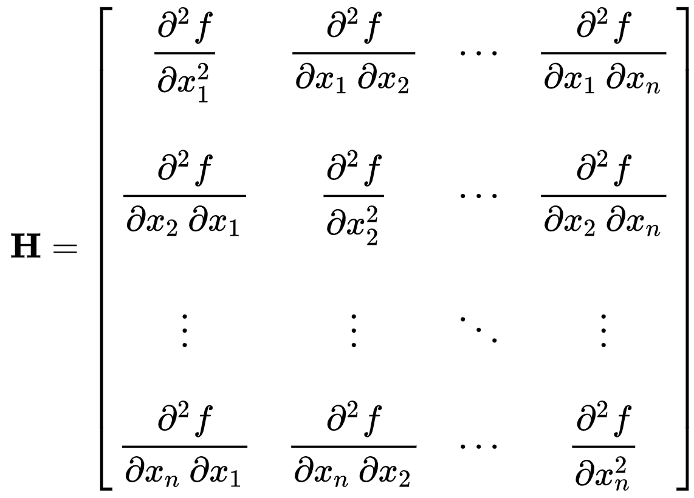
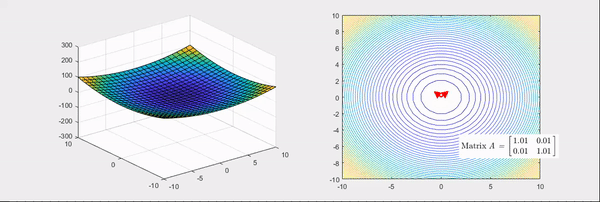
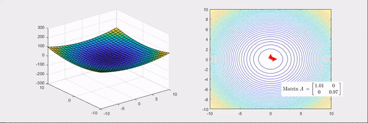

Starting with the definition of Hessian Matrix, this post will focus on the geometric meaning of Hessian matrix. Also, we will descuss about eigenvalues and eigenvector of Hessian, and introduce the application of the Hessian.

This post was written with reference to the following materials.
- [Donghoon Yeo's blog posting](https://angeloyeo.github.io/2020/06/17/Hessian.html)
- [Kahn Academy > Hessian](https://www.youtube.com/watch?v=LbBcuZukCAw)
- [Wikipedia > Hessian](https://en.wikipedia.org/wiki/Hessian_matrix)

---
# Hessian Matrix

## Definition
In mathematics, the Hessian matrix or Hessian is a square matrix of second-order partial derivatives of a scalar-valued function, or scalar field. It describes the local curvature of a function of many variables. [1]

Suppose $f : ℝ^n → ℝ$ is a function taking as input a vector $x ∈ ℝ^n$ and outputting a scalar $f(x) ∈ ℝ$. If all second partial derivatives of $f$ exist and are continuous over the domain of the function, then the Hessian matrix $H$ of $f$ is a square n×n matrix, usually defined and arranged as follows; [1]

<figure align="center">
    
    <figcaption>Figure 1. Hessian Matrix. [1]</figcaption>
</figure>

## Geometrical Meaning
<figure align="center">
    
    <figcaption>Figure 2. Hessian Matrix. [2]</figcaption>
</figure>

<figure align="center">
    
    <figcaption>Figure 3. Hessian Matrix. [2]</figcaption>
</figure>

## Meaning of Hessian's Eigenvalues and Eigenvectors

## Applications

---

## References
[1] “Hessian matrix,” Wikipedia, 24-Jun-2020. [Online]. Available: https://en.wikipedia.org/wiki/Hessian_matrix. [Accessed: 21-Jul-2020].
[2] Y. D. Yeo, “Geometrical meaning of Hessian Matrix,” 17-Jun-2020. [Online]. Available: https://angeloyeo.github.io/2020/06/17/Hessian.html. [Accessed: 21-Jul-2020].